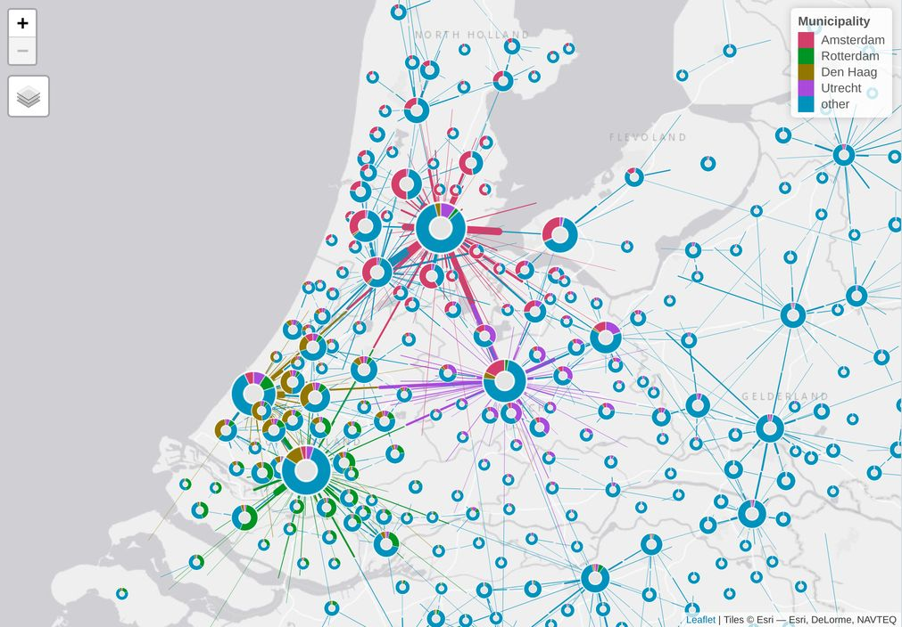

```{r setup, include = FALSE}
knitr::opts_chunk$set(
  collapse = TRUE,
  fig.width=7, 
  fig.height=5,
  comment = "#>"
)
```

## Introduction

The package name `odf` stands for origin destination (OD) flows.

Origin destination (OD) data describe movements from origins to destinations.
These movements typically relate to humans (e.g. migration, passenger transport), but can also relate to the export of goods, the animal migration, and decease spreading.

It is worth noting that when one talks about OD data of countable flows, one refers to *processed* (aggregated) data where the original *raw* dataset describes the movements of each individual. 
Usually, the raw OD data has been processed by the data owner or domain expert, while ODDV designers only have access to processed OD data.

Origin and destination locations can be points or polygons.
In the original raw data, these locations should in principle be points, but in practice for most OD data sets polygons are used, e.g. administrative units or grid tiles.
In transport studies, these polygons are often referred to as zones.

The `odf` package contains class definitions and methods for OD data.

```{r}
library(odf)
```

The current version is still in development.
A realistic option is to merge this package with the `od` package, which also contains partly-overlapping methods for OD data.


## Class `od`

The fundamental concept behind the `od` class is a graph structure $G = (U, E)$, where $U$ denotes the nodes and $E$ the edges. 
In our implementation, an object of class `od` is a list of two elements, `U` for nodes and `E` for edges.

The list element `U` is an `sf` data.frame (i.e. a data frame with a geometry column), where each record correspond to an origin or destination point (or zone), and where the geometry column contains the corresponding points or polygons.
It is important that one column in `U` should exist that contains key values by which origins and destinations can be identified.
The key column name is stored as an attribute named `od_id` in the `od` object.

The list element `E` is a data.frame object that contains data about the edges, i.e. the movements.
The only required columns in `E` are the origin and the destination identifier.
Each of these origin and destination ids should occur in the key column of `U`.
The names of the origin and destination columns are stored as attributes `od_orig` and `od_dest` in the `od` object.

Optionally, `E` can be an `sf` object that contains the polylines between origins and destinations.
These polylines can be the actual movement routes, simple straight lines, or anything in between.
This package contains a function to add lines automatically, with various options.

Note that users are free to add other columns to `U` and `E`. For aggregated OD data, `E` typically contains flow counts, and grouping variables such as mode of transport.

An example is contained in this package about Dutch commuting flows.

```{r}
# Read commuting data
data(NL_commuting)
data(NL_muni_poly)
data(NL_muni_point)
```

The dataset `NL_commuting` contains the estimated number of Dutch commuters grouped by mode of transport between municipalities. Cross-border commuters are not included.
The datasets `NL_muni_poly` and `NL_muni_point` contain the polygons and center points of the municipalities (the center points do not always correspond to the centroids of the polygons).

```{r}
x = od(NL_commuting, NL_muni_point, col_orig = "muni_from", col_dest = "muni_to", col_id = "id")
x
```


## Data manupulation

Users are free to choose their preferred data manipulation methods.

### Example 1: total flows
In the following code, `dplyr` methods are used to group, summarize and filter the data.
For each origin and destination pair, the total number of commuters is calculated (summing over all transport modes).
Next, the commuters who stay in their own municipality are filtered out, as well flows below 500.

```{r}
library(dplyr)
x_totals = x
x_totals$E = x_totals$E %>% 
  group_by(muni_from, muni_to) %>% 
  summarize(value = sum(value)) %>% 
  filter(muni_from != muni_to,
         value >= 500)

x_totals
```

The function `od_is_valid` can be used to check whether the processed data is still valid:

```{r}
od_is_valid(x_totals)
```

### Example 2: flows in the Randstad by transport mode

In the second example of data manipulation, we filter the data by region, where we focus on the western, most urban part of the Netherlands, called the Randstad.

```{r}
library(sf)
muni_prov = NL_muni_poly %>% 
              st_drop_geometry() %>% 
              select(id, NUTS2)

x_randstad = x
x_randstad$U = x_randstad$U %>% 
  left_join(muni_prov, by = "id") %>% 
  filter(NUTS2 %in% 31:33) %>% 
  select(-NUTS2)
```

We have filter the nodes `U`, by joining the data `NL_muni_poly`, which contains the province codes, and select the provinces 31 (Utrecht), 32 (North-Holland) and 33 (South-Holland).

Note that in the current state, `x_randstad` is not valid anymore, since `E` still contains flows that start and/or end outside this area.

```{r}
od_is_valid(x_randstad)
```

So, we'll have to filter the `E` set as well:

```{r}

x_randstad$E = x_randstad$E %>% 
  left_join(muni_prov, by = c("muni_from" = "id")) %>% 
  left_join(muni_prov, by = c("muni_to" = "id")) %>% 
  filter(NUTS2.x %in% 31:33,
         NUTS2.y %in% 31:33) %>% 
  select(-NUTS2.x, -NUTS2.y) %>% 
  filter(muni_from != muni_to,
         value >= 250)
  
x_randstad
```

When we check the validity again, we see that it is valid now:

```{r}
od_is_valid(x_randstad)
```


## Create and visualize lines

The function `od_add_lines` is used to draw lines between origin and destinations points.
By default slightly curved lines are drawn, in order to distinguish between opposite directions.

```{r}
x_totals = od_add_lines(x_totals)
```

Visualizing od data can be done with the `tmap` package:

```{r}
library(tmap)

tm_shape(x_totals$U) +
  tm_dots() +
tm_shape(x_totals$E) +
  tm_lines(lwd = "value", scale = 6, title.lwd = "Number of commuters") +
  tm_layout(scale = .5)
```

Below are maps with other default values: straight lines, curved lines and half-lines:

```{r}
library(tmap)
tm = tm_shape(x_totals$U) +
    tm_dots()
```

```{r}
x_totals_straight = od_add_lines(x_totals, angle = 0, overwrite.geometry = TRUE)
tm + 
  tm_shape(x_totals_straight$E) + tm_lines(lwd = "value", scale = 6) + 
  tm_layout(title = "Straight lines", scale = .5)
```

```{r}
x_totals_large_curve = od_add_lines(x_totals, angle = 1/6 * pi, overwrite.geometry = TRUE)
tm + 
  tm_shape(x_totals_large_curve$E) + tm_lines(lwd = "value", scale = 6) + 
  tm_layout(title = "Curved lines", scale = .5)
```

```{r}
x_totals_half_lines = od_add_lines(x_totals, angle = 0, range = c(.5, 1), overwrite.geometry = TRUE)
tm + 
  tm_shape(x_totals_half_lines$E) + 
  tm_lines(lwd = "value", scale = 6) + tm_layout(title = "Half lines", scale = .5)
```

For the second example, we will show small multiples, one per mode of transport:

```{r}
x_randstad = od_add_lines(x_randstad, angle = 0, range = c(.45, 1), overwrite.geometry = TRUE)

x_randstad$E = x_randstad$E %>% 
  mutate(value_plus_500 = value + 500)

basemap = tmaptools::read_osm(x_randstad$U)

qtm(basemap, is.master = TRUE) +
tm_shape(x_randstad$U) +
    tm_dots("grey30") +
  tm_shape(x_randstad$E) +
    tm_lines(lwd = "value_plus_500", scale = 20, col = "black", legend.lwd.show = FALSE) +
  tm_facets(by = "mode", free.coords = FALSE)
```

## Halfline doughnuts

A more sophisticated map using the same data is shown below:

```{r,echo=FALSE, out.width = "100%"}

```

This map can be created with the script https://github.com/mtennekes/odf/blob/demo/NL_commuting/halfline_doughnuts.R

See an [interactive prototype](http://www.mtennekes.nl/viz/commutingNL/) based on his visualization.
This version has a couple of new features: 1) it offers views for other parts of the country, 2) it also uses cross-border data (not open data yet), and 3) also the 'stay' population is shown in the doughnuts.

## Minimal example

This is a minimal example from the vignette  of the package `od` (https://github.com/ITSLeeds/od/blob/master/vignettes/od.Rmd)

```{r}
od_data_example = data.frame(
  o = "Leeds",
  d = "London",
  trips_per_year = 10
)

p = sf::st_as_sf(
  data.frame(
    name = c("Leeds", "London"),
    lon = c(-1.5, -0.1),
    lat = c(53.8, 51.5)
  ),
  coords = c("lon", "lat"),
  crs = 4326
)

x = od(E = od_data_example,
       U = p,
       col_orig = "o",
       col_dest = "d",
       col_id = "name")

x = od_add_lines(x) # by default a curved line to differentiate opposite directions

tm_shape(x$U) +
  tm_dots() +
tm_shape(x$E) +
  tm_lines()
```
